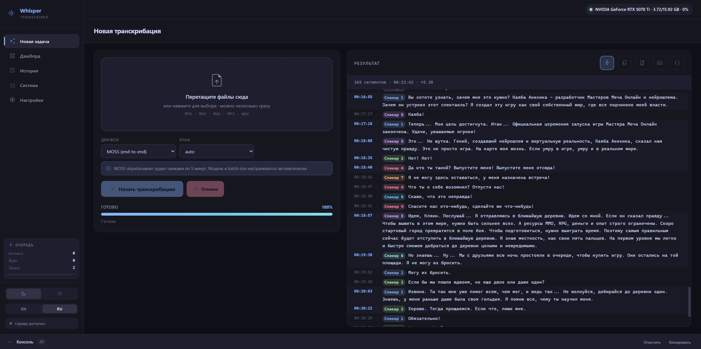
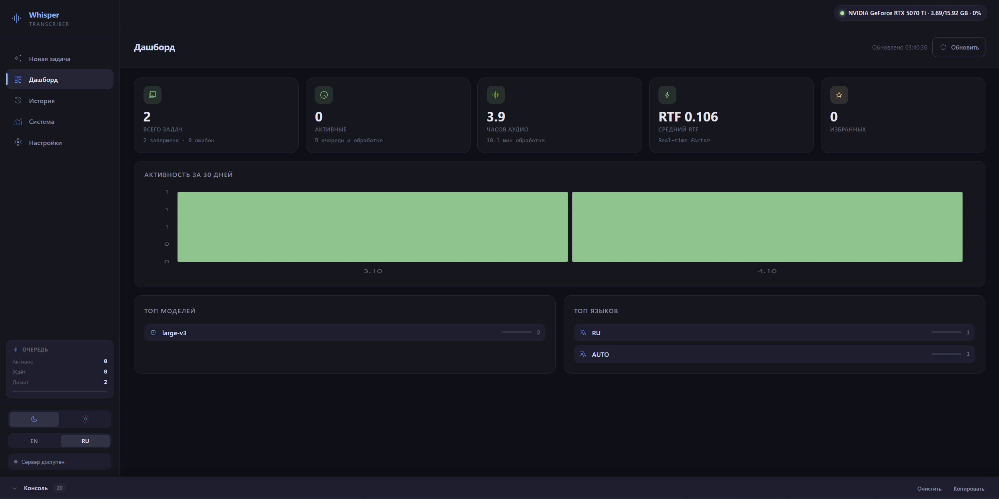
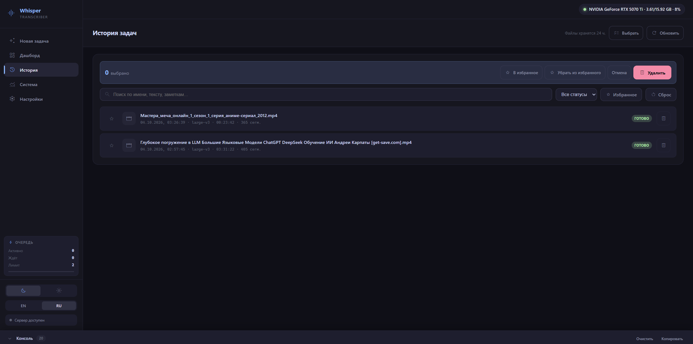
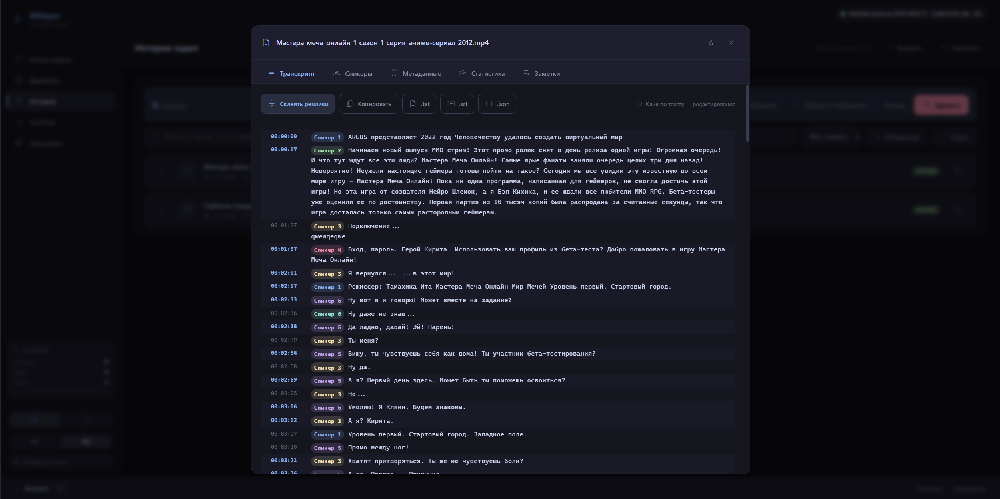
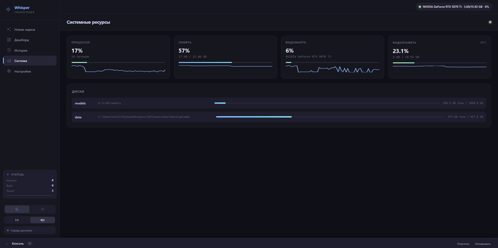
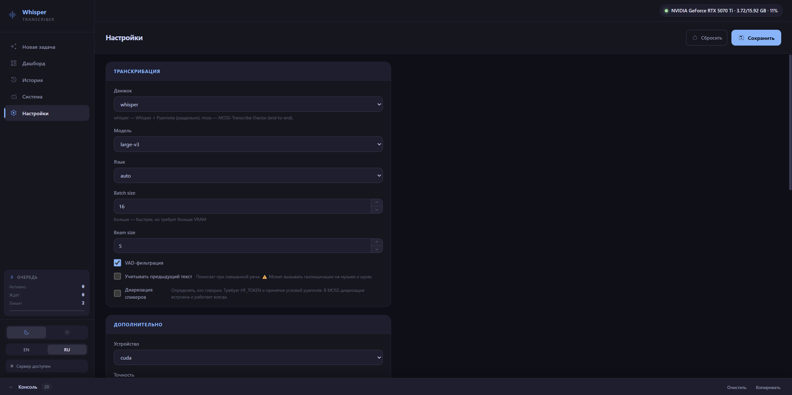
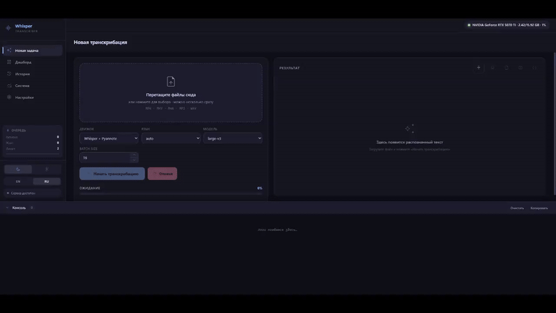

# 🎙️ Whisper Transcriber

Веб-приложение для транскрибации аудио и видео с использованием локальных
моделей. Работает на вашей GPU, данные не уходят в облако.

Поддерживает **два движка транскрибации**:
- **Whisper + Pyannote** — классический пайплайн, максимальная гибкость
- **MOSS-Transcribe-Diarize** — end-to-end модель с встроенной диаризацией

<p align="center">
  
  
  
  
</p>

---

## 🖼️ Интерфейс

### Новая задача

Выбор движка (`whisper` / `moss`), загрузка нескольких файлов, настройки
транскрибации и область результата с таймкодами. Поля фильтруются по
выбранному движку — при MOSS скрываются параметры Whisper.

<p align="center">
  
</p>

### Дашборд

Агрегированная статистика: количество задач, часы обработанного аудио,
средний RTF, график активности за 30 дней, топ моделей и языков.

<p align="center">
  
</p>

### История задач

Все транскрибации сохраняются в SQLite — история переживает перезапуск
сервера. Поиск по имени и тексту, фильтры по статусу и избранному, теги,
массовые операции удаления.

<p align="center">
  
</p>

### Детали задачи

Модалка с транскриптом, метаданными файла, статистикой обработки,
вкладкой спикеров, тегами и заметками. Клик по сегменту открывает
inline-редактор.

<p align="center">
  
</p>

### Системные ресурсы

CPU, RAM, GPU, VRAM, температура, питание, диски — обновление каждые
1.5 секунды со спарклайнами истории последних 60 замеров.

<p align="center">
  
</p>

### Настройки

Все параметры меняются без перезапуска сервера. Скрытые/видимые поля
зависят от активного движка. Значения по умолчанию читаются из `.env`,
runtime-переопределения сохраняются в `data/settings.json`.

<p align="center">
  
</p>

---

## 🎬 Демонстрации

### Whisper + Pyannote

Классический пайплайн: транскрибация через faster-whisper, диаризация
через Pyannote. Подходит для лекций, монологов, чистых записей.

<p align="center">
  
</p>

### MOSS-Transcribe-Diarize

End-to-end модель: транскрибация и диаризация за один проход. Лучше
разделяет спикеров в диалогах и на записях с музыкальным фоном.
Обрабатывает длинные файлы чанками по 5 минут.

<p align="center">
  
</p>

---

## ✨ Возможности

### Транскрибация

- 🎙️ **Два движка** — Whisper + Pyannote или MOSS (end-to-end)
- 🚀 **GPU-ускорение** — CUDA + float16, оптимизация под RTX 40xx/50xx
- 🌍 **Мультиязычность** — русский, английский, немецкий, французский и др.
- 👥 **Диаризация спикеров** — «кто говорил», с ручным переименованием
- 📊 **Live-прогресс** — SSE-стрим: логи, прогресс, сегменты, чанки
- 📁 **Экспорт** — TXT, SRT (с именами спикеров), JSON

### Работа с задачами

- 📚 **История в SQLite** — переживает перезапуск сервера
- 🎯 **Очередь задач** — FIFO с настраиваемым параллелизмом
- 🔍 **Поиск и фильтры** — по имени, тексту, тегам, статусу, избранному
- ⭐ **Избранное, теги, заметки** — для важных записей
- 🗑️ **Массовые операции** — удаление и избранное пачкой
- 📊 **Дашборд** — статистика, графики активности, топ моделей и языков

### UI/UX

- 📱 **Адаптивный интерфейс** — комфортно на телефонах и планшетах
- 🎨 **Тёмная и светлая темы**, переключение языка интерфейса
- 🔄 **Восстановление после F5** — активная задача не теряется
- 📋 **Живая консоль** — раздвижная панель с логами
- ✏️ **Правка сегментов** — клик по тексту открывает inline-редактор

### Прочее

- 🧹 **Автоочистка** — старые задачи и файлы удаляются по расписанию
- 📚 **OpenAPI / Swagger** — полная документация API
- 🔒 **Локально** — данные не уходят в облако (кроме скачивания моделей)

---

## 📋 Требования

### Аппаратные

| Компонент | Минимум | Рекомендуется |
|---|---|---|
| **GPU** | NVIDIA 6 ГБ VRAM | NVIDIA 12+ ГБ VRAM |
| **CPU** | любой x64 | 6+ ядер |
| **RAM** | 8 ГБ | 16+ ГБ |
| **Диск** | 10 ГБ | 20+ ГБ (под модели и файлы) |

**Требования по движкам:**
- **Whisper `large-v3`** в float16: ~4 ГБ VRAM
- **Whisper `large-v3` + `batch_size=16`**: ~10 ГБ VRAM
- **MOSS-Transcribe-Diarize**: ~3 ГБ VRAM + чанкинг для длинных файлов
- **Pyannote диаризация**: ~2 ГБ VRAM, требует HF-токен с принятыми условиями

### Программные

- **Python** 3.10+ (проверено на 3.12)
- **FFmpeg** (shared build, версия 6, 7 или 8) в системном PATH
- **NVIDIA драйвер** 535+ и CUDA Runtime 12.x
- **HF-токен** с принятыми условиями pyannote (для диаризации)

---

## 🚀 Установка

### 1. Клонирование

```bash
git clone https://github.com/your-repo/whisper-transcriber.git
cd whisper-transcriber
```

### 2. Виртуальное окружение

**Windows:**
```bash
python -m venv venv
venv\Scripts\activate
```

**Linux / macOS:**
```bash
python3 -m venv venv
source venv/bin/activate
```

### 3. Зависимости

```bash
pip install -r requirements.txt
```

### 4. PyTorch с CUDA

```bash
pip install torch torchaudio --index-url https://download.pytorch.org/whl/cu121
```

Для RTX 50xx (Blackwell, sm_120) нужен **CUDA 12.8+**:
```bash
pip install torch torchaudio --index-url https://download.pytorch.org/whl/cu128
```

### 5. FFmpeg

Обязательно **shared-сборка** (с DLL-файлами), не просто `.exe`.

**Windows:** скачайте `ffmpeg-7.1.1-full_build-shared.7z` с
[github.com/GyanD/codexffmpeg/releases](https://github.com/GyanD/codexffmpeg/releases/tag/7.1.1),
распакуйте, добавьте `bin/` в системный `PATH`.

**Linux:** `sudo apt install ffmpeg`

**macOS:** `brew install ffmpeg`

Проверка: `ffmpeg -version` и `where ffmpeg` (или `which ffmpeg`) должны
показать путь к исполняемому файлу.

### 6. MOSS-Transcribe-Diarize (опционально)

Если планируете использовать второй движок:

```bash
git clone https://github.com/OpenMOSS/MOSS-Transcribe-Diarize.git
cd MOSS-Transcribe-Diarize
pip install -e .
```

После установки в UI → Настройки → **Движок транскрибации** → `moss`.

Модель скачается автоматически при первом запуске (~1.8 ГБ) в
`<MODELS_DIR>/OpenMOSS-Team/MOSS-Transcribe-Diarize/`.

### 7. Конфигурация

```bash
cp .env.example .env      # Linux / macOS
copy .env.example .env    # Windows
```

Минимально нужно заполнить:

```env
HF_TOKEN=hf_xxxxxxxxxxxxxxxxxxxxxxxxxxxxx
MODELS_DIR=G:\LLMs\models
```

### 8. Принятие условий для pyannote (для диаризации)

Перейдите по ссылкам под своей учётной записью HF и нажмите
**«Agree and access repository»**:

- [pyannote/speaker-diarization-3.1](https://huggingface.co/pyannote/speaker-diarization-3.1)
- [pyannote/segmentation-3.0](https://huggingface.co/pyannote/segmentation-3.0)
- [pyannote/speaker-diarization-community-1](https://huggingface.co/pyannote/speaker-diarization-community-1)

Без принятия условий диаризация вернёт `GatedRepoError: 403`.

### 9. Запуск

```bash
python run.py
```

Откройте в браузере:

- **http://127.0.0.1:8000** — веб-интерфейс
- **http://127.0.0.1:8000/docs** — Swagger API
- **http://127.0.0.1:8000/redoc** — ReDoc API

---

## 🎯 Выбор движка

| Характеристика | Whisper + Pyannote | MOSS-Transcribe-Diarize |
|---|---|---|
| **Архитектура** | Два прохода: текст → голоса | Один проход: текст + голоса |
| **Точность границ** | Средняя (два источника ошибок) | **Высокая** (end-to-end) |
| **Скорость** | Высокая (faster-whisper) | Ниже (авторегрессия Qwen) |
| **VRAM** | ~4–10 ГБ | ~3 ГБ + чанки |
| **Языки** | 99 (все Whisper) | 50+ (включая русский) |
| **Гибкость** | Все параметры настраиваются | Меньше ручек |
| **Длинные файлы** | До 2 часов | Через чанки по 5 минут |

**Рекомендация:**
- **Совещания, интервью, диалоги** → MOSS (лучше разделяет спикеров)
- **Лекции, монологи, музыка** → Whisper + Pyannote (быстрее и гибче)
- **Быстрые черновики** → Whisper `large-v3-turbo`

Оба движка сосуществуют. В UI → Настройки → **Движок транскрибации**
переключается мгновенно. Настройки разных движков сохраняются раздельно.

---

## 📖 Использование

### Веб-интерфейс

1. **Новая задача** — перетащите один или несколько файлов в зону загрузки.
   Поддерживаются MP4, MKV, AVI, MOV, WebM, M4A, MP3, WAV, FLAC, OGG.
2. Выберите **движок**, **язык**, для Whisper — модель и batch size.
3. **«Начать транскрибацию»** — задачи встанут в очередь.
4. Прогресс и логи — в раздвижной консоли внизу.
5. Результат — справа, с таймкодами и спикерами.
6. Экспорт: `.txt`, `.srt`, `.json` или копирование в буфер.

### Диаризация

Если включена (для Whisper), после транскрибации запускается Pyannote.
Спикеры подписаны цветными бейджами. Переименование — во вкладке
**«Спикеры»** в карточке задачи.

**Совет:** для дубляжа или совещаний указывайте `min_speakers` и
`max_speakers` в настройках — Pyannote точнее работает с ограничениями.

### История

Все задачи в SQLite. Фильтры: поиск по имени/тексту/тегам, статус,
избранное. Массовые операции — кнопка **«Выбрать»** в шапке истории.

### Дашборд

KPI-карточки (всего задач, активные, часы аудио, средний RTF,
избранных), график активности за 30 дней, топ моделей и языков.

---

## 🔌 API

Полная документация — в Swagger по адресу `/docs`.

### Быстрый старт

```bash
curl -X POST http://127.0.0.1:8000/api/jobs \
  -F "file=@meeting.m4a" \
  -F "engine=moss" \
  -F "language=ru"
```

Ответ:
```json
{"job_id": "a1b2c3d4e5f6", "status": "queued"}
```

### Batch-загрузка

```bash
curl -X POST http://127.0.0.1:8000/api/jobs/batch \
  -F "files=@a.m4a" \
  -F "files=@b.m4a" \
  -F "engine=whisper" \
  -F "model=large-v3"
```

### SSE-подписка

```bash
curl -N http://127.0.0.1:8000/api/jobs/a1b2c3d4e5f6/stream
```

События: `snapshot`, `log`, `progress`, `status`, `segment`,
`segments_replaced`, `done`, `error`, `cancelled`.

### Python-клиент

```python
import requests
import json

BASE = "http://127.0.0.1:8000"

with open("meeting.m4a", "rb") as f:
    r = requests.post(
        f"{BASE}/api/jobs",
        files={"file": f},
        data={"engine": "moss", "language": "ru"},
    )
    job_id = r.json()["job_id"]

with requests.get(f"{BASE}/api/jobs/{job_id}/stream", stream=True) as r:
    for line in r.iter_lines():
        if not line or not line.startswith(b"data: "):
            continue
        event = json.loads(line[6:])
        if event["type"] == "progress":
            print(f"{event['value']}% — {event.get('message', '')}")
        elif event["type"] == "segment":
            seg = event["segment"]
            print(f"[{seg['start']:.1f}] {seg.get('speaker', '?')}: {seg['text']}")
        elif event["type"] == "done":
            print("\n" + event["text"])
            break
```

---

## ⚙️ Конфигурация

### HuggingFace

| Переменная | По умолчанию | Описание |
|---|---|---|
| `HF_TOKEN` | `""` | Токен доступа (Read). Обязателен для pyannote |
| `HF_TRANSFER` | `true` | Устарело в новых версиях HF Hub |
| `HF_DOWNLOAD_TIMEOUT` | `30` | Таймаут HTTP-запросов к HF Hub |

### Пути

| Переменная | По умолчанию | Описание |
|---|---|---|
| `MODELS_DIR` | `G:\LLMs\models` | Корневая папка моделей |
| `DATA_DIR` | `data` | Файлы, БД, настройки |

### Сервер

| Переменная | По умолчанию | Описание |
|---|---|---|
| `HOST` | `127.0.0.1` | Адрес прослушивания |
| `PORT` | `8000` | Порт |
| `LOG_LEVEL` | `info` | Уровень логирования uvicorn |
| `CORS_ORIGINS` | `*` | Разрешённые origins |

### Транскрибация

| Переменная | По умолчанию | Описание |
|---|---|---|
| `DEFAULT_ENGINE` | `whisper` | Движок по умолчанию |
| `DEFAULT_MODEL` | `large-v3` | Модель Whisper |
| `DEFAULT_LANGUAGE` | `ru` | Язык |
| `DEFAULT_BATCH_SIZE` | `8` | Batch size (Whisper) |
| `DEFAULT_VAD` | `true` | VAD-фильтрация |
| `DEFAULT_COMPUTE_TYPE` | `float16` | Точность вычислений |
| `DEFAULT_DEVICE` | `cuda` | `cuda` / `cpu` |
| `DEFAULT_CONDITION_ON_PREVIOUS` | `false` | Контекст из предыдущего сегмента |
| `DEFAULT_INITIAL_PROMPT` | `""` | Промпт (оставьте пустым!) |

### Диаризация

| Переменная | По умолчанию | Описание |
|---|---|---|
| `DIARIZATION_ENABLED` | `false` | Включить Pyannote |
| `DIARIZATION_MIN_SPEAKERS` | `0` | Мин. спикеров (0 = автодетект) |
| `DIARIZATION_MAX_SPEAKERS` | `0` | Макс. спикеров (0 = автодетект) |

### MOSS-Transcribe-Diarize

Применяются только при `engine=moss`. Настраиваются в UI → Advanced.

| Переменная | По умолчанию | Описание |
|---|---|---|
| `MOSS_CHUNK_DURATION` | `300` | Размер чанка в секундах. 180 для 8 ГБ VRAM, 600 для 24+ ГБ |
| `MOSS_CHUNK_OVERLAP` | `2` | Перехлёст чанков. Устраняет потерю слов на границах |
| `MOSS_MAX_NEW_TOKENS` | `4096` | Макс. токенов текста на чанк |

### Очередь и очистка

| Переменная | По умолчанию | Описание |
|---|---|---|
| `MAX_UPLOAD_MB` | `4096` | Максимальный размер файла |
| `MAX_PARALLEL_JOBS` | `1` | Одновременных задач |
| `RETENTION_HOURS` | `24` | Хранить завершённые задачи |
| `CLEANUP_INTERVAL_MIN` | `30` | Период автоочистки |

---

## 🧠 Модели

### Whisper (faster-whisper / CTranslate2)

| Модель | Размер | VRAM (float16) | Скорость | Качество |
|---|---|---|---|---|
| `tiny` | 75 МБ | ~1 ГБ | ×32 | низкое |
| `base` | 145 МБ | ~1 ГБ | ×16 | базовое |
| `small` | 484 МБ | ~2 ГБ | ×6 | хорошее |
| `medium` | 1.5 ГБ | ~5 ГБ | ×2 | очень хорошее |
| `large-v2` | 3.1 ГБ | ~4 ГБ | ×1 | отличное |
| `large-v3` | 3.1 ГБ | ~4 ГБ | ×1 | лучшее |
| `large-v3-turbo` | 1.6 ГБ | ~2 ГБ | ×8 | почти как large-v3 |

Хранятся в `<MODELS_DIR>/Systran/faster-whisper-<имя>/`. Структура
LM Studio-подобная.

### MOSS-Transcribe-Diarize

End-to-end модель (~1.8 ГБ BF16). Хранится в
`<MODELS_DIR>/OpenMOSS-Team/MOSS-Transcribe-Diarize/`.

Длинные аудио режутся на чанки по 5 минут с перехлёстом 2 секунды.
Дубликаты на границах автоматически удаляются.

### Pyannote

`pyannote/speaker-diarization-3.1` — ~50 МБ. Кэшируется в
`~/.cache/huggingface/hub/`.

---

## ⚠️ Проблемные зависимости и известные подводные камни

Этот раздел — концентрат реальных проблем, с которыми сталкиваются
пользователи. Каждая проблема решена в коде, но важно понимать, почему
именно так, а не иначе.

### 1. CUDA DLL не находятся (`cublas64_12.dll is not found`)

**Симптом:**
```
RuntimeError: Library cublas64_12.dll is not found or cannot be loaded
```

**Причина:** `ctranslate2` (движок faster-whisper) ищет CUDA-библиотеки,
но пакеты `nvidia-*` кладут их в `site-packages/nvidia/*/bin/`, а не в
системный `PATH`. На Linux работает через `LD_LIBRARY_PATH`, на Windows —
нет.

**Решение:** `run.py` регистрирует пути через `os.add_dll_directory()`
**до импорта `ctranslate2`**. Вручную ничего прописывать не нужно, но:

1. Запускать строго через `python run.py`, не `python app/server.py`.
2. Установить пакеты: `pip install nvidia-cublas-cu12 nvidia-cuda-runtime-cu12 nvidia-cudnn-cu12`.
3. Проверить, что запущен **тот же Python**, где установлены пакеты
   (не глобальный, если работаете в venv).

### 2. HF-токен отклонён для pyannote (`GatedRepoError: 403`)

**Симптом:**
```
GatedRepoError: 403 Client Error.
Cannot access gated repo for url
https://huggingface.co/pyannote/speaker-diarization-community-1/...
```

**Причина:** модели Pyannote под лицензией, требующей явного принятия.
Токена недостаточно — нужно принять условия на странице модели.

**Решение:** под своей учётной записью HF принять условия для:

- `pyannote/speaker-diarization-3.1`
- `pyannote/segmentation-3.0`
- `pyannote/speaker-diarization-community-1`

После принятия токен начнёт работать.

### 3. `use_auth_token` vs `token` (несовместимость версий pyannote)

**Симптом:**
```
TypeError: Pipeline.from_pretrained() got an unexpected keyword argument 'use_auth_token'
```

**Причина:** в `pyannote.audio >= 4.0` параметр переименован с
`use_auth_token` на `token`. Код должен поддерживать обе версии.

**Решение:** `app/diarization.py` пробует сначала `token=...`, при
`TypeError` откатывается на `use_auth_token=...`, при второй ошибке —
на вызов без параметра (использует `HF_TOKEN` из env).

### 4. `libtorchcodec` не загружается

**Симптом:**
```
Could not load libtorchcodec. Likely causes:
  1. FFmpeg is not properly installed...
  2. PyTorch version (2.11.0+cu130) is not compatible...
```

**Причина:** `pyannote.audio 4.x` использует `torchcodec` для
декодирования аудио. На Windows DLL-файлы FFmpeg не находятся
автоматически.

**Два пути решения:**

**A. Обход TorchCodec** — аудио загружается через `torchaudio.load()`
и передаётся в пайплайн как in-memory тензор. Так делает код в
`app/diarization.py` — это безопаснее и не зависит от версий.

**B. Починить DLL** — скачать **shared-сборку** FFmpeg (не обычную!),
скопировать все `*.dll` из `bin/` в
`site-packages/torchcodec/`, откатить `torchcodec==0.7.0`.

### 5. `DiarizeOutput` object has no attribute `itertracks`

**Симптом:**
```
AttributeError: 'DiarizeOutput' object has no attribute 'itertracks'
```

**Причина:** в `pyannote.audio 3.x` пайплайн возвращает `Annotation`,
в `4.x` — `DiarizeOutput` с полем `speaker_diarization` внутри.

**Решение:** `app/diarization.py::_extract_annotation` проверяет обе
структуры и предпочитает `exclusive_speaker_diarization` — он даёт
непересекающиеся интервалы, что упрощает сопоставление с Whisper.

### 6. Галлюцинации Whisper на музыке (initial_prompt)

**Симптом:** в транскрипте появляются дословные повторы
`initial_prompt` — например «Используются технические термины на
русском языке» — в тех местах, где на самом деле музыка или тишина.

**Причина:** Whisper обучен возвращать `initial_prompt` как «ответ»,
когда не понимает речь. Это документированная проблема OpenAI/Whisper.

**Решение:** в `app/config.py` дефолт `DEFAULT_INITIAL_PROMPT = ""`.
Также отключён `condition_on_previous_text` по умолчанию (он тоже
усиливает галлюцинации).

**Правило:** задавайте `initial_prompt` только если уверены, что
аудио — чистая речь без музыки. Для лекций и совещаний — можно. Для
аниме, видеоклипов, стримов — пусто.

### 7. Whisper галлюцинирует длинные сегменты на 60–100 секунд

**Симптом:** сегмент `[0.79 — 103.00]` с 50 словами — явно растянут.

**Причина:** VAD не находит пауз для разбиения в плотной звуковой
дорожке (музыка, SFX). Whisper «склеивает» фразу в один сегмент.

**Решение:** функция `_resplit_long_segments` в `app/transcribe.py`
принудительно режет сегменты длиннее 25 секунд по границам слов.

Параметр `chunk_length=30` в `BatchedInferencePipeline` **не помогает** —
он управляет только входным окном, а не длиной выходного сегмента.

### 8. Pyannote переоценивает число спикеров

**Симптом:** в диалоге двух человек Pyannote определяет 7 спикеров.

**Причина:** модель склонна к переоценке на коротких репликах и
сменах интонации — каждый нюанс голоса становится отдельным кластером.

**Решение:** указывайте `min_speakers` и `max_speakers` в настройках.
Для дубляжа аниме 2–4, для совещаний — по числу участников.

**Дополнительно:** функция `smooth_short_switches` в `app/diarization.py`
поглощает короткие (≤ 2 сек) выбросы между сегментами одного спикера.

### 9. MOSS: `Cannot use apply_chat_template`

**Симптом:**
```
ValueError: Cannot use apply_chat_template because this processor
does not have a chat template.
```

**Причина:** в репозитории MOSS отсутствует `chat_template.jinja`.
Файл есть только в зеркалах.

**Решение:** `app/moss_transcribe.py` включает `*.jinja` в паттерны
скачивания. Если файла нет — его можно скачать из зеркала
`soniqo/MOSS-Transcribe-Diarize-0.9B-ONNX-FP16` и положить в папку
модели вручную.

### 10. MOSS: `model.safetensors` не найден

**Симптом:**
```
FileNotFoundError: 'G:\...\model.safetensors'
```

**Причина:** MOSS раздаёт **шардированные** веса с именем
`model-00000-of-00001.safetensors`, а не единый `model.safetensors`.

**Решение:** `_find_model_weights` в `app/moss_transcribe.py` ищет
любой из паттернов: `model.safetensors`, `model-*.safetensors`,
`pytorch_model.bin`, `pytorch_model-*.bin`.

### 11. MOSS: CUDA OOM на длинных аудио

**Симптом:**
```
torch.OutOfMemoryError: CUDA out of memory. Tried to allocate 2.79 GiB.
```

**Причина:** MOSS держит всё аудио в памяти за один проход, KV-кэш
растёт линейно с длительностью. Для 17-минутного файла на 16 ГБ VRAM
памяти **не хватает**, даже с float16.

**Решение:** чанкинг. `app/moss_transcribe.py` режет аудио на куски
по 5 минут с перехлёстом 2 секунды. Дубликаты на границах
автоматически удаляются функцией `_dedupe_overlap`.

**Тюнинг:**
- OOM даже на чанках → уменьшить `CHUNK_DURATION_SEC` до 240 или 180
- Хочется быстрее → увеличить до 420 (но следить за VRAM)

### 12. `HF_HUB_ENABLE_HF_TRANSFER` deprecated

**Симптом:**
```
FutureWarning: The `HF_HUB_ENABLE_HF_TRANSFER` environment variable
is deprecated as 'hf_transfer' is not used anymore.
```

**Причина:** HF Hub перешёл на Xet для высокоскоростной передачи.

**Решение:** безвредное предупреждение. Можно игнорировать или
заменить `HF_HUB_ENABLE_HF_TRANSFER=1` на `HF_XET_HIGH_PERFORMANCE=1`.

### 13. Предупреждения Pyannote (не критичны)

Все три — безвредны, можно игнорировать:

- **`std(): degrees of freedom is <= 0`** — статистический слой Pyannote
  на очень коротких (< 0.1 сек) фрагментах.
- **`triton not found; flop counting will not work`** — на Windows
  Triton не поддерживается, PyTorch сообщает о недоступности счётчика.
- **`TF32 has been disabled`** — Pyannote намеренно отключает TF32
  ради воспроизводимости.

### 14. Английские слова в русской речи

**Симптом:** в русском тексте «Кубернетес» вместо «Kubernetes».

**Решение в коде:** `temperature=[0.0, 0.2, ..., 1.0]`, `condition_on_previous=False`,
дефолтный `hotwords`.

**Пользователю:**
- Добавить термины в `hotwords` (настройки → advanced)
- Использовать `large-v3` (лучше справляется со смешанной речью)
- Не использовать `initial_prompt` на записях с музыкой

### 15. FFmpeg version mismatch

**Симптом:** `Could not load libtorchcodec` при попытке загрузить
любую версию FFmpeg.

**Причина:** обычная сборка FFmpeg (`ffmpeg-*-full_build.7z`)
содержит только `.exe`, но **не DLL**. TorchCodec их не находит.

**Решение:** скачать **`-shared`-сборку**
(`ffmpeg-7.1.1-full_build-shared.7z`) — она содержит все нужные DLL.

---

## 🏗️ Архитектура

```
whisper-transcriber/
├── run.py                       # Точка входа: env vars, CUDA DLL, uvicorn
├── requirements.txt
├── .env.example
├── README.md
│
├── app/
│   ├── __init__.py              # версия пакета
│   ├── config.py                # .env + runtime-настройки + RUNTIME_SCHEMA
│   ├── storage.py               # SQLite: JobRepository
│   ├── jobs.py                  # Job, JobManager
│   ├── queue.py                 # TaskQueue (FIFO + параллелизм)
│   ├── monitor.py               # CPU / RAM / GPU / диски
│   ├── transcribe.py            # Диспетчер: выбор движка
│   ├── moss_transcribe.py       # MOSS-Transcribe-Diarize
│   ├── diarization.py           # Pyannote + постобработка
│   ├── media_info.py            # ffprobe + SHA-256
│   ├── i18n.py                  # Загрузчик локалей
│   └── server.py                # FastAPI: REST, SSE, статика
│
├── locales/
│   ├── ru.json
│   └── en.json
│
├── static/
│   ├── index.html
│   ├── style.css
│   ├── app.js
│   └── fonts/
│       └── material-symbols-rounded.woff2
│
└── data/                        # создаётся автоматически
    ├── uploads/                 # загруженные файлы
    ├── jobs.db                  # SQLite с историей
    └── settings.json            # runtime-настройки
```

### Поток данных (диспетчер + очередь)

```
Клиент  →  POST /api/jobs (multipart)
          ↓
       [Файл → data/uploads/, SHA-256]
          ↓
       [Job создаётся, статус queued]
          ↓
       [job_id → TaskQueue (FIFO)]
          ↓
       [Воркер берёт задачу]
          ↓
       [transcribe.run() — диспетчер]
          ├─ engine=whisper → Whisper → Pyannote → слияние
          └─ engine=moss    → MOSS (чанки 5 мин) → dedupe
          ↓
Клиент  ←  GET /api/jobs/{id}/stream (SSE)
          ←  snapshot + log + progress + segment + done
          ↓
Клиент  ←  GET /api/jobs/{id}/result (JSON)
```

---

## 🛠️ Разработка

### Запуск в dev-режиме

```bash
python run.py
```

Автоперезагрузка не поддерживается, потому что `run.py` выполняет
критичную инициализацию (env vars, CUDA DLL) до импорта приложения.
При изменении кода — перезапускайте вручную.

### Добавление нового движка

1. Создайте `app/<engine>_transcribe.py` с функцией `run(job)` и
   `is_available()`.
2. В `RUNTIME_SCHEMA` (в `config.py`) добавьте опцию в
   `transcription.engine` и поля с `"engine": "<engine>"`.
3. В `app/transcribe.py::run` добавьте ветку диспетчера.

### Локализация

Файлы `locales/*.json` — плоские словари `ключ → строка`. После правки
перезапустите сервер.

---

## 🗺️ Идеи для развития

- [ ] **Суммаризация** через локальную LLM (Qwen 2.5, Llama 3.2)
- [ ] **Перевод** субтитров на другие языки (NLLB, MarianMT)
- [ ] **Live-транскрибация** с микрофона через MediaRecorder
- [ ] **Docker + docker-compose** для одной команды развёртывания
- [ ] **Аутентификация** через JWT или API-ключи
- [ ] **WebSocket** вместо SSE для двунаправленного канала
- [ ] **WhisperX** как третий движок (форсированное выравнивание)
- [ ] **NVIDIA Nemotron** как четвёртый движок диаризации

---

## 📄 Лицензия

MIT — используйте, модифицируйте и распространяйте свободно.

---

## 🙏 Благодарности

- [OpenAI Whisper](https://github.com/openai/whisper) — оригинальная ASR-модель
- [faster-whisper](https://github.com/SYSTRAN/faster-whisper) — оптимизация через CTranslate2
- [CTranslate2](https://github.com/OpenNMT/CTranslate2) — быстрый движок инференса
- [MOSS-Transcribe-Diarize](https://github.com/OpenMOSS/MOSS-Transcribe-Diarize) — end-to-end ASR + диаризация
- [Pyannote.audio](https://github.com/pyannote/pyannote-audio) — диаризация спикеров
- [FastAPI](https://fastapi.tiangolo.com/) — веб-фреймворк
- [Material Symbols](https://fonts.google.com/icons) — иконки от Google
